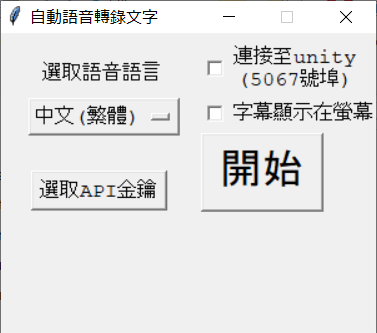
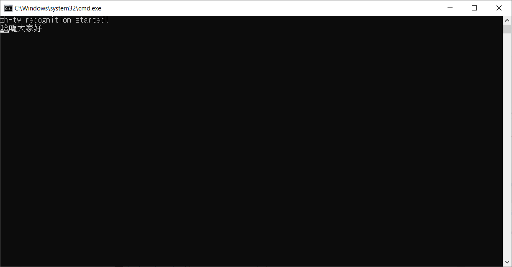

# Unity_live_caption
利用 Google Speech-to-Text API 和 Unity 來做實時直播上字幕！ 可以跟你的虛擬腳色很好的搭配使用！ 真人的youtuber當然也可以！

**重要訊息 : 這個API是要收費的！ 收費規則在[這裡](https://cloud.google.com/speech-to-text/pricing).**

這是我 [youtube直播](https://www.youtube.com/watch?v=AZsUm_cuj9U) 演示的結果。

## 前置作業

你要先有google帳號。

根據[官網](https://cloud.google.com/speech-to-text/)的指示，在主控台啟用`Speech-to-Text` API，並且下載API金鑰(會是一個`.json`檔)。

中文的話我只介紹圖形介面(GUI)怎麼使用，如果想從命令行執行的話，請參照英文的[README](README.md)。
    
## GUI使用方法

1.  從[這裡](https://github.com/kwea123/Unity_live_caption/releases/tag/v1.0)下載 `googlesr_gui_chinese.zip`

2.  打開 `googlesr_gui_chinese.exe` 然後你會看到

3.  選擇語言，設置剛才下載的API金鑰並且選擇是否連結到unity或者要不要在螢幕上直接顯示字幕。要連結到unity的話，請看[unity設置](#unity設置)

4.  按開始。他會需要一些時間啟動。啟動完成後你會看到以下的圖片，然後就可以開始講話了。

5.  同時按 `Ctrl` 和 `c` 來結束錄音。

6.  **請務必絕對一定要按結束，不然他會持續算錢！免責聲明：本人不負責任何正當或非正當使用本程式所帶來的任何費用！使用者皆視為同意我的免責聲明。**

## unity設置

1.  先設置一個Text component (`GameObject->UI->Text`)
2.  在那個Text component上加上這裡的`subtitleListener.cs`
3.  執行unity(在編輯器或是執行檔都可以)之後，他就會開始聆聽傳過去的字幕，然後這時再開始GUI的錄音即可。

## 其他問題
可以在[這裡](https://github.com/kwea123/Unity_live_caption/issues)詢問

